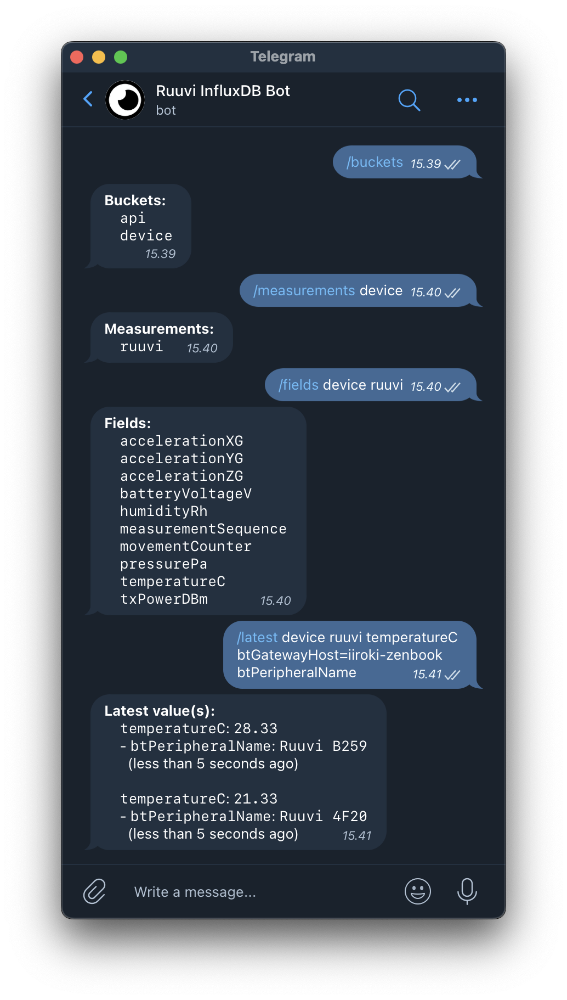

# InfluxDB Telegram Bot

**_Telegram bot for InfluxDB._**



**Features:**
- Browse InfluxDB schema
- Read values from InfluxDB
- Create chart visualizations from InfluxDB field values
- Save action shortcuts as buttons
- TODO: Define notification rules and send notifications

## Quickstart

### Development

1. Install npm dependencies:
    ```
    npm i
    ```

2. Fill the required env variables listed in [Configuration](#configuration).

3. Start the bot in development mode:
    ```
    npm run dev
    ```

### Deployment

The bot has a deployment template in order to deploy the bot to [Fly.io](https://fly.io/).

1. Launch new Fly app:
    ```
    flyctl launch
    ```

2. Set the required env variables:
    ```
    flyctl secrets set <key>=<value> <key>=<value> ...
    ```

3. Deploy the bot:
    ```
    flyctl deploy
    ```

## Configuration

| Env variable | Description |
| ----- | ----- |
| `TG_API_TOKEN` | Telegram API token |
| `TG_ALLOWED_USERNAMES` | Comma-separated list of allowed Telegram usernames |
| `INFLUX_URL` | InfluxDB URL |
| `INFLUX_TOKEN` | InfluxDB API token |
| `INFLUX_ORG` | InfluxDB organization |
| `TZ` | Timezone for [`date-fns`](https://date-fns.org/) |

## Commands

The bot implements the following commands:

| Command | Description |
| ----- | ----- |
| `/help` | Get link to this section. |
| [`buckets`](#buckets) | List all buckets. |
| [`measurements`](#measurements) | List all measurements in a bucket. |
| [`fields`](#fields) | List all fields of a measurement. |
| [`tags`](#tags) | List all tags of a measurement. |
| [`tag`](#tag) | List all values of a tag. |
| [`get`](#get) | Read values for a field. |
| [`chart`](#chart) | Create a chart visualization of field values. |
| [`actions`](#actions) | Run and manage saved actions. |

**NOTE:** Brackets `[...]` indicate optional parameters!

### `buckets`

**Usage: `/buckets`**

List all InfluxDB buckets.

### `measurements`

**Usage: `/measurements <bucket>  [<config>]`**

List all measurements in InfluxDB bucket.

**Params:**
- `bucket`: InfluxDB bucket name
- `config`: See [`InfluxTimespanParams`](#influxtimespanparams) in [`<config>`](#config).
    - Specify InfluxDB query timespan.

### `fields`

**Usage: `/fields <bucket> <measurement> [<config>]`**

List all fields of InfluxDB measurement.

**Params:**
- `bucket`: InfluxDB bucket name
- `measurement`: InfluxDB measurement name
- `config`: See [`InfluxTimespanParams`](#influxtimespanparams) in [`<config>`](#config).
    - Specify InfluxDB query timespan.

### `tags`

**Usage: `/tags <bucket> <measurement> [<config>]`**

List all tags of InfluxDB measurement.

**Params:**
- `bucket`: InfluxDB bucket name
- `measurement`: InfluxDB measurement name
- `config`: See [`InfluxTimespanParams`](#influxtimespanparams) in [`<config>`](#config).
    - Specify InfluxDB query timespan.

### `tag`

**Usage: `/tag <bucket> <measurement> <tag> [<config>]`**

List all tags of InfluxDB measurement.

**Params:**
- `bucket`: InfluxDB bucket name
- `measurement`: InfluxDB measurement name
- `tag`: InfluxDB tag name
- `config`: See [`InfluxTimespanParams`](#influxtimespanparams) in [`<config>`](#config).
    - Specify InfluxDB query timespan.

### `get`

**Usage: `/get <bucket> <measurement> <field> <where> [<config>]`**

Read the latest values for InfluxDB field.
The values can be filtered by specifying InfluxDB tag filter.

**Params:**
- `bucket`: InfluxDB bucket name
- `measurement`: InfluxDB measurement name
- `field`: InfluxDB field name
- `where`: InfluxDB tag filter consisting of tag-value pairs.
    - Tags and values are separated by equal sign (`=`) and pairs by commas (`,`).
    - `*` can be used to match all values.
    - Example: `host=name,region=finland` can be used to find the values from specific host and region.
- `config`: See [`InfluxTagParams`](#influxtagparams) in [`<config>`](#config).
    - Specify InfluxDB query timespan.
    - Specify the shown InfluxDB tags in the command response.

### `chart`

**Usage: `/chart <type> <bucket> <measurement> <field> <where> [<config>]`**

Create [Chart.js](https://www.chartjs.org/) visualization of InfluxDB field.
The command returns InfluxDB fields as graph labels and tags as image caption.
The graph values are aggregated by default.

**Params:**
- `type`: Graph type (`line` or `bar`)
- `bucket`: InfluxDB bucket name
- `measurement`: InfluxDB measurement name
- `field`: InfluxDB field name
- `where`: InfluxDB tag filter consisting of tag-value pairs.
    - Tags and values are separated by equal sign (`=`) and pairs by commas (`,`).
    - `*` can be used to match all values.
    - Example: `host=name,region=finland` can be used to find the values from specific host and region.
- `config`: See [`InfluxAggregateParams`](#influxaggregateparams) and [`ChartConfig`](#chartconfig) in [`<config>`](#config).
    - Specify InfluxDB query timespan.
    - Specify the shown InfluxDB tags in the command response.
    - Specify InfluxDB aggregate timespan.
    - Specify whether to query raw values from InfluxDB.

### `actions`

**Usage: `/actions [<add|remove|get>] [<name*>] [<command*>]`**

**\*** = Required only when adding a new action.

Run and manage saved actions a.k.a shortcuts for other commands.
The actions are persisted on disk and are user-specific.

**Example:**
```
/actions add "Example Action" /get my-bucket my-measurement my-field *
```

### `<config>`

`<config>` consists of additional parameters for a bot command.

Configuration "object" consists of multiple key-value pairs:
- Keys and values are separated by equal sign (`=`).
- If the value is a list, the list items are separated by commas (`,`).
- Pairs are separated by semicolons (`;`).
- Exaple: `firstKey=value;secondKey=secondValue1,secondValue2;thirdKey=thirdValue`

The config can be one of the following:
- [`InfluxTimespanParams`](#influxtimespanparams)
- [`InfluxTagParams`](#influxtagparams)
- [`InfluxAggregateParams`](#influxaggregateparams)
- [`ChartConfig`](#chartconfig).

#### `InfluxTimespanParams`

Specify InfluxDB query timespan.

**Keys:**
- `start`: Start time of the query as a relative InxluxDB time or an absolute UTC time without milliseconds.
    - Relative format: `-7d`, `-1h`, `-5m`
    - Absolute format: `2023-02-28T19:00:00Z`
    - Default: `-7h`
- `end`: End time of the query as a relative InxluxDB time or an absolute UTC time without milliseconds.
    - Relative format: `1d`, `-2h`, `-10m`
    - Absolute format: `2023-02-28T19:00:00Z`

#### `InfluxTagParams`

Specify returned InfluxDB tags.

**Keys:**
- `tags`: Comma-separated list of InfluxDB tags to return.

#### `InfluxAggregateParams`

Specify InfluxDB aggregate properties.
The used aggregate function is mean/average.

**Keys:**
- `aggregate`: InfluxDB aggregate timespan.
    - Default: `1h`
- `raw`: Whether to query raw values from InfluxDB (= disable aggregation).

#### `ChartConfig`

Specify Chart.js properties.

**Keys:**
- `min`: Minimum y-value for the graph.
- `max`: Maximum y-value for the graph.
- `color`: Graph color offset (different offsets produce different color schemes).
- `seconds`: Whether to show seconds in the x-axis labels.

## License

**MIT License** Copyright (c) 2023 Iiro Kiviluoma
