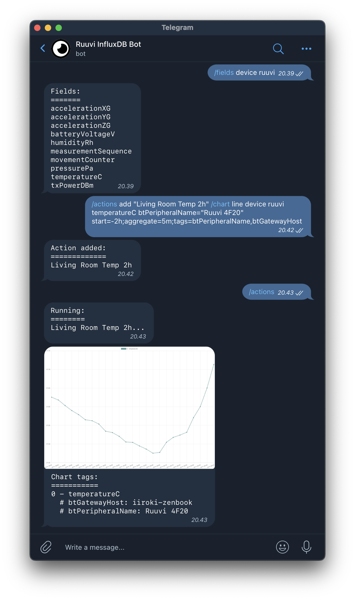

# InfluxDB Telegram Bot

Telegram bot for InfluxDB.



**Features:**
- Browse InfluxDB schema
- Read latest values
- TODO: Create graph visualizations from a timespan
- TODO: Define notification rules and send notifications

## Quickstart

### Development

1. Install npm dependencies:
    ```
    npm i
    ```

2. Fill the required env variables listed in [Configuration](#configuration).

3. Start the bot in development mode:
    ```
    npm run dev
    ```

### Deployment

The bot has a deployment template in order to deploy the bot to [Fly.io](https://fly.io/).

1. Launch new Fly app:
    ```
    flyctl launch
    ```

2. Set the required env variables:
    ```
    flyctl secrets set <key>=<value> <key>=<value> ...
    ```

3. Deploy the bot:
    ```
    flyctl deploy
    ```

## Commands

The bot implements the following commands:

| Command | Parameters | Description |
| ----- | ----- | ----- |
| `/buckets` | - | List all buckets. |
| `/measurements` | `<bucket>` | List all measurements in a bucket. |
| `/fields` | `<bucket> <measurement>` | List all fields of a measurement in a bucket. |
| `/tags` | `<bucket> <measurement>` | List all tags of a measurement in a bucket. |
| `/tag` | `<bucket> <measurement> <tag>` | List all values of a measurement's tag in a bucket. |
| `/latest` | `<bucket> <measurement> <field> <tagFilters> [<shownTags>]`**\*** | Get the latest value(s) for a fields that match the tag filter. |

**\*** `tagFilters` and `shownTags` are in the following format:
- `tagFilters`: Comma separated list of tag filters in key-value pairs (Example: `location=home,host=server`).
  - `*` can be used to match all values!
- `shownTags`: Comma separated list of tag names (Example: `location,host`).

## Configuration

| Env variable | Description |
| ----- | ----- |
| `TG_API_TOKEN` | Telegram API token |
| `TG_ALLOWED_USERNAMES` | Comma-separated list of allowed Telegram usernames |
| `INFLUX_URL` | InfluxDB URL |
| `INFLUX_TOKEN` | InfluxDB API token |
| `INFLUX_ORG` | InfluxDB organization |
